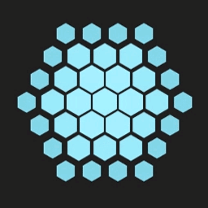
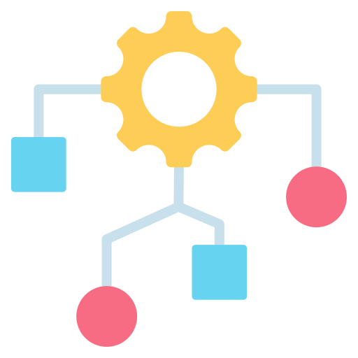

<h1 align="center">
    <!--  -->
    
    <div align="center">Logic Tracer</div>
</h1>

[](https://github.com/Yrrrrrf/logic_tracer)
[](https://crates.io/crates/logic_tracer)
[](https://docs.rs/logic_tracer)

Logic Traces is a simple crate that reads a logical proposition and interprets it to **build the truth table and the AST of the proposition**.  

Makes use of regular expressions are used to validate the input and to tokenize the proposition.  
Also implements the [Shunting Yard Algorithm](https://en.wikipedia.org/wiki/Shunting-yard_algorithm) (not yet) to build the AST.

## Examples

Check the [examples](./examples/) direcotry to see how to use the crate.
```bash
cargo run --example <example name>
```

## Roadmap
- [x] Read a logical proposition
- [x] Tokenize the proposition
- [x] Validate Input Tokens (only valid tokens)
    - [x] Variables (only letters)
    - [x] Logical Operators (and, or, not, implies, iff)
    - [x] Mathematical Operators (add, sub, mul, div, pow)
    - [x] Terms (only numbers, variables, variable with subindex)
- [ ] Parse the proposition (make sure it is valid)
- [ ] Build the AST (Shunting Yard Algorithm) (use postfix notation)
- [ ] Add notation to the AST (prefix, infix, postfix)
- [ ] **Solve proposition** (evaluate the AST)
- [ ] Add good looking output for truth table, ast, function, etc.
- [ ] Reduce a proposition to its simplest form (boolean algebra) 
    - [ ] Reagrupate terms (boolean algebra)
    - [ ] Apply De Morgan's laws (boolean algebra)
    - [ ] Apply distributive, associative and commutative laws (boolean algebra)
- [ ] Add more examples
- [ ] Add more tests
- [ ] Improve documentation
- [ ] Improve the import/export of the crate (to improve it's usability as a library)

### Future
- [ ] Add comlex math iteration (sums, products, etc.) (to be able to solve more complex propositions)
    - [ ] Test a proposition with complex math iteration
- [ ] Add combinational logic (multiplexers, decoders, etc.)
- [ ] Add sequential logic (flip-flops, registers, etc.)

----

## License

This project is licensed under the terms of the [MIT license](./LICENSE)
